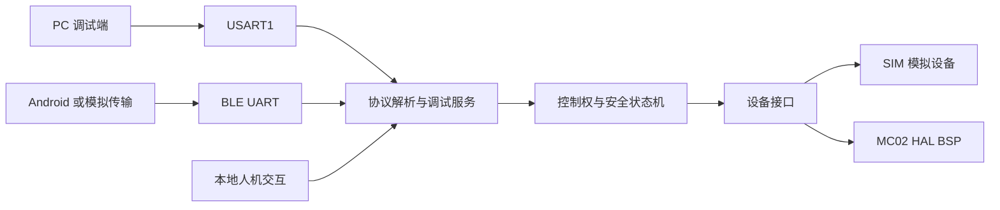

# 软件架构

```mermaid
flowchart LR
    PC["PC 调试端"] --> UART["USART1"]
    BLE["Android 或模拟传输"] --> BS["BLE UART"]
    UART --> P["协议解析与调试服务"]
    BS --> P
    LCD["本地人机交互"] --> P
    P --> A["控制权与安全状态机"]
    A --> D["设备接口"]
    D --> S["SIM 模拟设备"]
    D --> H["MC02 HAL BSP"]
```

线协议与 GPIO 分离。每路传输分别持有解析器。设备入口使用统一对象与明确返回值。电机、舵机、动力、显示、按键、电压、电流、编码器和位置反馈有类型独立的函数接口。
首版安全状态由周期任务独占。下一阶段将串口解析和遥测放入低优先级工作，并以单槽最新指令和一致状态快照跨任务交换。无授权或必要输入不可用时输出保持禁止。真实硬件配置不链接模拟驱动。
